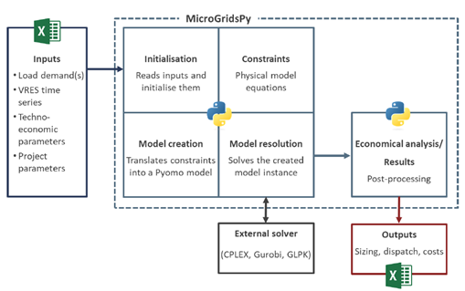

Welcome to MicroGridsPy's documentation!
===================================

**MicroGridsPy** is a bottom-up, open-source optimization model, running on `Pyomo <https://pyomo.readthedocs.io/en/stable/>`_ , a Python library used to model optimisation problems, whose primary goal is to offer an open-source approach to the issue of *energy scaling and dispatch* in mini-grids in remote locations. It was first developed in 2016 by the University of Liege and the code is freely available on GitHub [1]. The model enables the **optimization of micro-grid size** and its **dispatch strategy** at the *1-hour temporal resolution*, also returning as output the fixed and variable costs associated with each technology and the LCOE of the system. It is based on **Linear Programming**, and it enables the choice of the installed capacities of batteries, generators, and renewable energy sources that result in the lowest **Net Present Cost (NPC)** or lowest **Operation and Maintenance expenses (O&M)** during the project's lifespan while achieving the system limitations. However, in the latest version, it is also possible to consider a **Multi-objective Optimization** such as costs and emissions to model different scenarios with different drivers like environmental impact, **Mixed-Integer Linear Programming (MILP) formulation** with an integrated *unit commitment approach* to determine the optimal operating schedule of power generation units over a given time horizon to meet the electricity demand while minimizing operational costs. The MILP formulation offers the chance to keep the main advantages of LP whilst offering a satisfying approximation of *non-linear behaviour*, at the expense of a *lower computational efficiency*. Nonetheless, an accurate MILP characterization of components such as diesel generators requires high-quality data regarding their real-life and site-specific operation, preferably based on real measurements. 
The main inputs required by the tool to initialize the variables and formulate linear constraints are **time series of load demand** at 1-hour resolution for one year (or more years); **time series of RES production** at 1-hour resolution for one year; **techno-economic parameters** of the technologies and project parameters. 

In the latest version of MicroGridsPy the following advanced features have been implemented:

* Modeling of the **Generator Partial Load Effect**;
* **Endogenous Load Curve Estimation** based on structured *archetypes* referring to **rural villages in Sub-Saharan Africa** at different latitudes;
* **Endogenous calculation of RES production times series**, solar and wind, relying on the *NASA POWER platform* [2];
* Possibility of simulating the connection of the mini-grid with an **existing main grid** by detailing electricity flows in both directions (electricity 
  taken from the grid or fed into the grid), as well as the **availability of the national grid** in the event of blackouts. 
 
Check out the :doc:`usage` section for further information, including
how to :ref:`installation` the project.

.. note::

   This project is under active development.

Contents
--------

.. toctree::

   intro
   usage
   building
   formulation
   contributors
   API

References
=========================================
.. [1] https://github.com/SESAM-Polimi/MicroGridsPy-SESAM/tree/Development_MILP 
.. [2] https://power.larc.nasa.gov/api/temporal/
